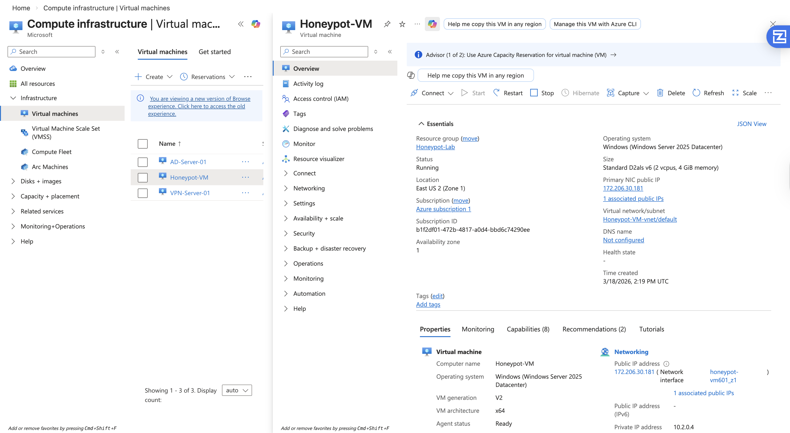
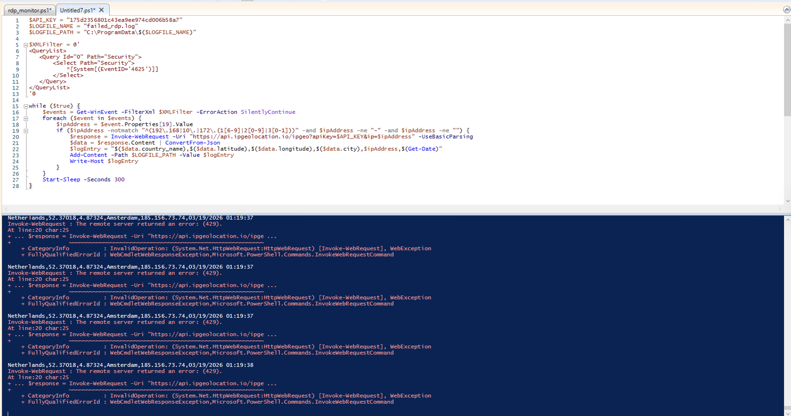
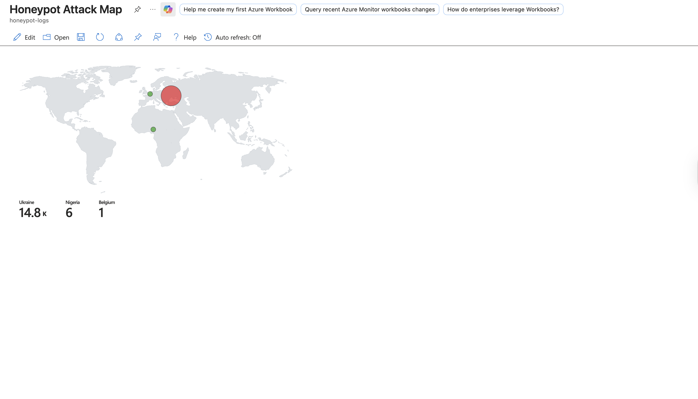
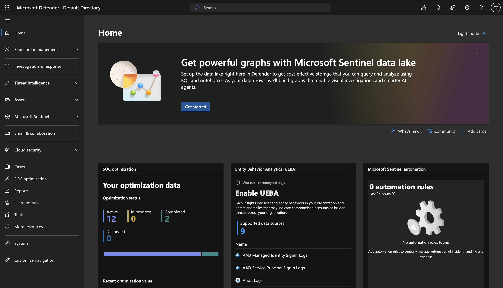

# Honeypot SIEM Lab — Microsoft Azure & Microsoft Sentinel

## Overview
Deployed a deliberately vulnerable Windows Server honeypot in Microsoft 
Azure and monitored real-world attacks using Microsoft Sentinel SIEM. 
This lab demonstrates hands-on skills in cloud security, log analysis, 
and security monitoring relevant to SOC Analyst and Cybersecurity roles.

## Tools & Technologies
- Microsoft Azure (Cloud Infrastructure)
- Windows Server 2025 Datacenter
- Microsoft Sentinel (SIEM)
- Log Analytics Workspace
- Windows Defender Firewall
- PowerShell
- IP Geolocation API (ipgeolocation.io)
- KQL (Kusto Query Language)

## What I Built

### 1. Honeypot VM Deployment
Deployed a Windows Server 2025 virtual machine in Microsoft Azure 
(East US 2 region). Configured the Network Security Group to allow 
all inbound traffic, making the VM intentionally vulnerable to 
attract real attackers from the internet.

### 2. Firewall Configuration
Disabled Windows Defender Firewall on all profiles (Domain, Private, 
and Public) to ensure the VM was fully discoverable and accessible 
to external threat actors.

### 3. Microsoft Sentinel Setup
Created a Log Analytics Workspace and deployed Microsoft Sentinel as 
the SIEM solution. Connected Windows Security Events via AMA data 
connector to stream all security logs from the honeypot into Sentinel 
for analysis.

### 4. PowerShell Attack Monitor
Wrote and deployed a PowerShell script that:
- Continuously monitors Windows Event ID 4625 (failed RDP logins)
- Extracts attacker IP addresses from the Security Event log
- Queries the ipgeolocation.io API to get country, city, and coordinates
- Logs all data, including geolocation, to a local file for ingestion

### 5. Attack Visualization
Built a custom Microsoft Sentinel Workbook using KQL queries to 
visualize attack data on an interactive world map. The map uses 
a green-to-red heatmap to show attack intensity by geographic location.

## Results
Within hours of deployment, the honeypot attracted tens of thousands of
real brute force RDP attacks from multiple countries around the world,
demonstrating how quickly exposed systems are discovered and targeted
on the internet.

## Key Findings
- Over 14,800 failed RDP login attempts captured from Ukraine alone
- Attacks originated from multiple countries, including Ukraine, Nigeria, and Belgium
- Attacks began within minutes of VM deployment
- Common usernames targeted: Administrator, admin, user, guest
- Hit ipgeolocation.io free API rate limits (HTTP 429) due to high attack
  volume — a real-world indicator of how aggressively the honeypot was targeted

## Screenshots
| Screenshot | Description |
|---|---|
| Azure Portal | Honeypot VM running in cloud |
| PowerShell | Script capturing live attack data |
| Sentinel Map | World map showing attack origins |
| Sentinel Dashboard | Microsoft Sentinel SIEM fully configured |

### Azure Portal — Honeypot VM Running

### PowerShell — Live Attack Data

### Microsoft Sentinel — World Attack Map

### Microsoft Sentinel — SIEM Dashboard

## Skills Demonstrated
- Cloud VM deployment and security configuration (Azure)
- SIEM deployment and configuration (Microsoft Sentinel)
- Log Analytics and KQL querying
- PowerShell scripting for security automation
- Threat monitoring and attack visualization
- Network security group configuration
- Real-world threat analysis

## Resume Bullet Point
"Deployed a Windows Server honeypot in Microsoft Azure and monitored
real-world RDP brute force attacks using Microsoft Sentinel SIEM.
Captured 14,800+ failed login attempts from multiple countries, including
Ukraine, Nigeria, and Belgium. Enriched data with IP geolocation and
visualized global attack origins on an interactive world map using KQL."
